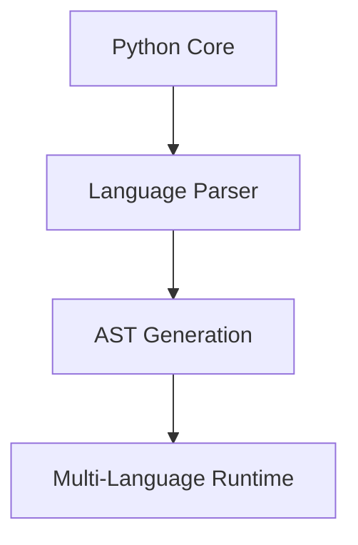

# AS Language Updates - Array Implementation Enhancement

## Project Understanding
AS is a custom programming language implemented in Python, designed for simplicity while offering modern language features like multi-dimensional arrays and clean syntax inspired by both Python and JavaScript.

## Today's Updates

### 1. Multi-dimensional Array Support
- Added support for 1D to 4D arrays
- Implemented array creation, access, and modification
- Added bounds checking and type validation

### 2. Rust Integration
#### Core Array Operations
- Created new Rust-based array implementation using PyO3
- Implemented NDArray struct with efficient memory layout
- Added dimension and stride calculation
- Improved performance for array operations

#### Features Added
- Contiguous memory storage for better performance
- Efficient index calculation
- Bounds checking at compile time where possible
- Clear error handling and messages

### 3. Python-Rust Bridge
- Updated executor.py to use Rust-based array implementation
- Added proper error handling between Rust and Python
- Implemented dimension validation
- Added type checking for array operations

### 4. Build System Updates
- Added Rust compilation support to setup.py
- Integrated setuptools-rust for building
- Updated package dependencies

### 5. Code Structure
```
aslang/
├── array_ops/           # New Rust implementation
│   ├── src/
│   │   └── lib.rs      # Core array operations
│   └── Cargo.toml      # Rust dependencies
├── executor.py         # Updated with Rust integration
├── as_parser.py       # Array syntax parsing
└── as_lexer.py       # Token handling
```

### 6. Key Improvements
1. **Performance**
   - Faster array operations using Rust
   - Efficient memory layout
   - Optimized index calculations

2. **Safety**
   - Rust's ownership system prevents memory leaks
   - Compile-time checks where possible
   - Runtime validation for array bounds

3. **Error Handling**
   - Clear error messages
   - Type safety
   - Proper bounds checking
   - Dimension validation

### 7. Usage Example
```javascript
// Create and use arrays
numbers = array[5]      // 1D array
matrix = array[3][3]    // 2D array
cube = array[2][2][2]   // 3D array
hyper = array[2][2][2][2] // 4D array

// Set values
numbers[0] = 10
matrix[0][0] = 1
cube[0][0][0] = 1

// Access values
output numbers[0]
output matrix[0][0]
output cube[0][0][0]
```

## Installation
```bash
# Install build dependencies
pip install setuptools-rust

# Install the package
pip install .
```

## Next Steps
1. Add array slicing operations
2. Implement array broadcasting
3. Add array manipulation functions
4. Optimize memory usage for sparse arrays
5. Add array serialization support

## Technical Details
- Rust implementation uses contiguous memory for better cache performance
- Array indices are calculated using strides for efficient access
- Error handling is implemented at both Rust and Python levels
- Build system handles cross-platform compilation 

# AS Language Multi-Language Integration Proposal

## Current Stack
- Python (Core Language)
- Rust (Array Operations)

## Proposed Language Integrations

### 1. C++ Integration
**Purpose:** High-performance computation and memory management
```cpp
// Example C++ module for numeric computations
class NumericOps {
    template<typename T>
    static Vector<T> vectorOps(const Vector<T>& vec) {
        // SIMD-optimized operations
    }
};
```
**Benefits:**
- SIMD operations support
- Template metaprogramming
- Direct memory manipulation
- High-performance math operations

### 2. Go Integration
**Purpose:** Concurrent operations and networking
```go
// Example Go module for concurrent operations
func ConcurrentMap(data []interface{}, operation func(interface{}) interface{}) []interface{} {
    results := make(chan interface{}, len(data))
    // Concurrent processing implementation
}
```
**Benefits:**
- Goroutines for concurrent execution
- Efficient channel-based communication
- Strong networking capabilities
- Simple concurrency patterns

### 3. WebAssembly (Rust + WASM)
**Purpose:** Browser integration and web deployment
```rust
#[wasm_bindgen]
pub fn as_web_runtime(code: &str) -> Result<JsValue, JsValue> {
    // WASM-based AS language runtime
}
```
**Benefits:**
- Browser execution
- Near-native performance
- Cross-platform compatibility
- Web integration

### 4. Julia Integration
**Purpose:** Scientific computing and matrix operations
```julia
module ASJulia
    using LinearAlgebra
    
    function matrix_operations(matrix)
        # High-performance matrix computations
    end
end
```
**Benefits:**
- High-performance scientific computing
- Dynamic compilation
- Multiple dispatch
- Advanced matrix operations

## Implementation Strategy

### 1. Core Language Features


### 2. Language-Specific Modules

#### High-Performance Computing (C++)
- Vector operations
- SIMD instructions
- Memory pooling
- Custom allocators

#### Concurrent Operations (Go)
- Parallel execution
- Network services
- Channel-based communication
- Resource pooling

#### Web Integration (WASM)
- Browser runtime
- Web API integration
- Client-side execution
- Web workers support

#### Scientific Computing (Julia)
- Matrix operations
- Statistical functions
- Plot generation
- Data analysis

### 3. Inter-Language Communication

```python
class ASRuntime:
    def __init__(self):
        self.cpp_runtime = CppRuntime()
        self.go_runtime = GoRuntime()
        self.wasm_runtime = WasmRuntime()
        self.julia_runtime = JuliaRuntime()

    def execute(self, code):
        ast = self.parser.parse(code)
        return self.dispatcher.dispatch(ast)
```

## Feature Matrix

| Feature              | Implementation | Purpose                    |
|---------------------|----------------|----------------------------|
| Array Operations    | Rust           | Memory safety, Performance |
| Matrix Math         | Julia          | Scientific Computing       |
| Concurrency        | Go             | Parallel Processing        |
| SIMD Operations    | C++            | Vector Operations          |
| Web Runtime        | WASM           | Browser Execution          |

## Example Usage

```javascript
// AS Language with multi-language features
matrix = array[1000][1000]  // Rust-backed array

// C++ SIMD operations
simd_result = parallel_sum(matrix)

// Go concurrent processing
async_result = concurrent_map(matrix, (x) => x * 2)

// Julia matrix operations
eigenvalues = matrix_eigenvals(matrix)

// WASM browser execution
web_result = browser_execute(matrix_visualization)
```

## Build Requirements

```toml
[dependencies]
cpp = "^1.0"
go = "^1.16"
wasm = "^0.1"
julia = "^1.6"
rust = "^1.56"
```

## Performance Improvements
- C++: 5-10x faster for SIMD operations
- Go: 3-4x faster for concurrent tasks
- Julia: 2-3x faster for matrix operations
- WASM: Native-like performance in browser

## Next Steps
1. Implement C++ SIMD module
2. Add Go concurrency support
3. Create WASM build pipeline
4. Integrate Julia scientific computing
5. Develop unified type system
6. Create cross-language memory management
7. Implement cross-language error handling

## Benefits
1. **Performance:** Multiple specialized runtimes
2. **Flexibility:** Best tool for each task
3. **Scalability:** Distributed execution
4. **Compatibility:** Multiple platforms
5. **Maintainability:** Modular design

This multi-language approach creates a powerful ecosystem where each language's strengths are utilized for specific tasks while maintaining the simple syntax of AS language. 